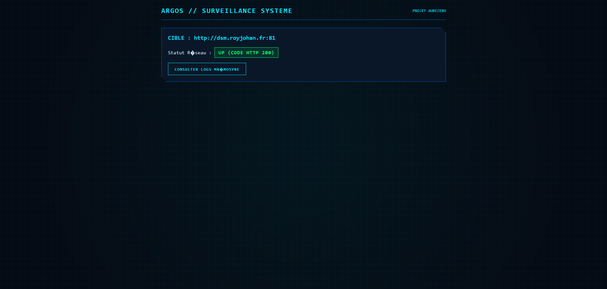

# 👁️ Argos - Surveillance Extérieure & Heartbeat

> **Module de sécurité et de supervision distante du projet [AubeZero](https://github.com/ROYJohan08/AubeZero)**

---

## 📌 Présentation

Désigné d'après le géant aux cent yeux de la mythologie grecque, **Argos** est le module sentinelle d'AubeZero. Placé en extérieur (notamment sur le serveur distant `api.royjohan.fr`), sa mission principale est d'assurer la supervision permanente des éléments d'infrastructure internes et d'émettre les protocoles d'alerte ou de sécurité en cas d'anomalie ou d'indisponibilité.

---

## 🎯 Fonctions Principales

* 📡 **Checking de disponibilité (Heartbeat)** :
  * Monitoring régulier de la joignabilité et de l'état des serveurs (`dsm.royjohan.fr`, infrastructure locale du NAS, etc.).
  * Vérification de la connectivité réseau et des accès externes.
* 🛡️ **Émission des Protocoles de Sécurité** :
  * Déclenchement automatique de protocoles en cas de perte de signal d'un serveur critique.
  * Transmission d'alertes sécurisées via les modules de communication (*Hermes* / notifications).
  * Isolation ou basculement de secours (Failover) en fonction des scénarios d'urgence configurés.

---

## 📸 Aperçu des fonctionnalités (Carrousel / Accordéon)

<details open>
  <summary><b>1. Module GPS - Vue globale (AZGps.php - Page 1)</b></summary>
  <br>
  <p align="center">
    
  </p>
</details>

<details>
  <summary><b>2. Module GPS - Détails et suivi (AZGps.php - Page 2)</b></summary>
  <br>
  <p align="center">
    
  </p>
</details>

<details>
  <summary><b>3. Protocoles réseau - Configuration (AZProtocoles.php - Page 1)</b></summary>
  <br>
  <p align="center">
    
  </p>
</details>

<details>
  <summary><b>4. Protocoles réseau - État et logs (AZProtocoles.php - Page 2)</b></summary>
  <br>
  <p align="center">
    
  </p>
</details>

<details>
  <summary><b>5. Vérification du statut système (AZUpCheck.php)</b></summary>
  <br>
  <p align="center">
    
  </p>
</details>

## 🏗️ Integration dans l'Architecture AubeZero

`Argos` communique et s'interface directement avec plusieurs modules de l'écosystème :

| Module | Interaction |
| :--- | :--- |
| **Cerbere** | Vérification et validation des identifiants & jetons d'accès pour les requêtes de surveillance. |
| **Hermes** | Relais de l'émission des alertes et des notifications d'urgence. |
| **Athena** | Déclenchement des mécanismes d'auto-défense système et de routage d'urgence. |

---

## 📂 Structure du Fichier & Variables d'Environnement

Le module s'intègre sous l'arborescence standard d'AubeZero :

```text
/etc/AubeZero/Argos/
├── config.env          # Configuration des endpoints à surveiller et des fréquences de ping
├── scripts/             # Scripts de vérification de santé (healthcheck) et d'alertes
└── README.md
